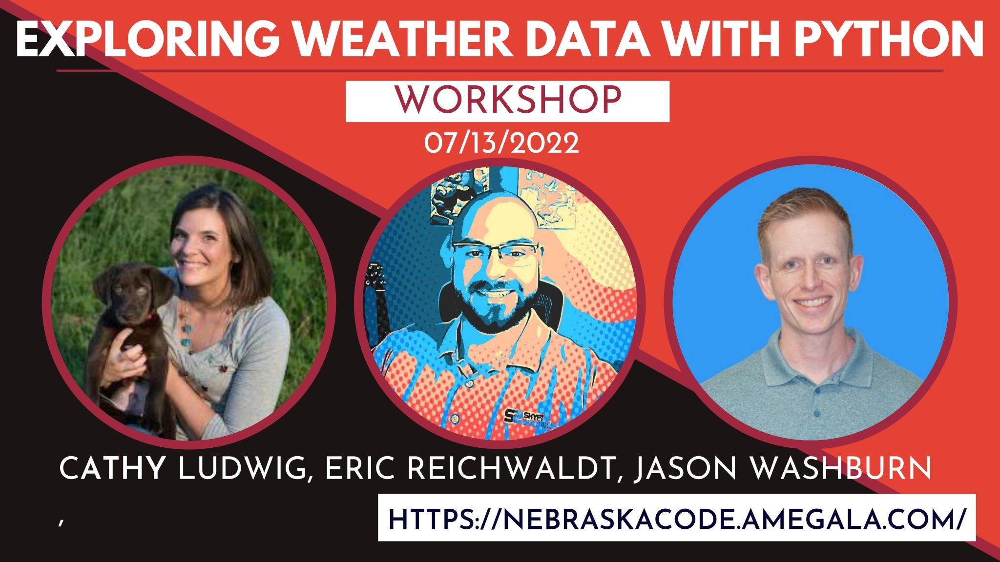
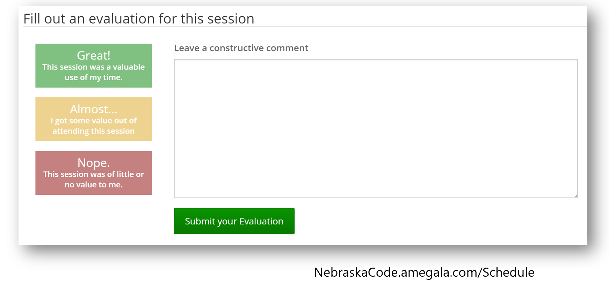

# Exploring Weather Data Workshop Schedule

## Session 1 (8:30 - 10 am)
- Intros - Cathy, Eric, Jason
- Initial setup verification
- Weather data overview

### Break

## Session 2 (10:30 am - 12 pm)
- Exploring GRIB data
- Data extraction and visualization

### Lunch

## Session 3 (1 - 2:30 pm)
- Exporing feature data with MetPy
- FastAPI intro

### Break

## Session 4 (3 - 4:30 pm)
- Making a weather data API
- Custom endpoints

## Speaker Evaluation
- Please log in to your Nebraska Code profile to leave us a review!
- Click on Schedule -> List
- Find the class that's highlighted
- Click on "Fill out evaluation for this session"
- Submit

## Stay in touch!

**Shyft Solutions** 
- Twitter: [@shyftsolutions](https://twitter.com/shyftsolutions)
- LinkedIn: [https://linkedin.com/company/shyftsolutions](https://linkedin.com/company/shyftsolutions)
- Email: training@shyftsolutions.io

**Jason**
- Twitter: [@\_\_jwashburn__](https://twitter.com/__jwashburn__)
