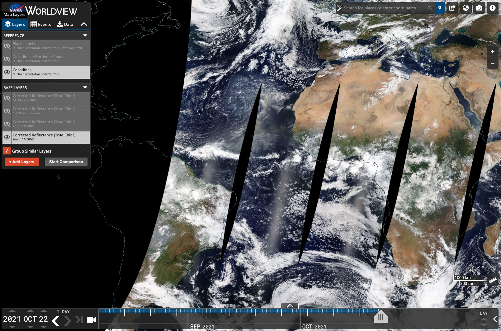
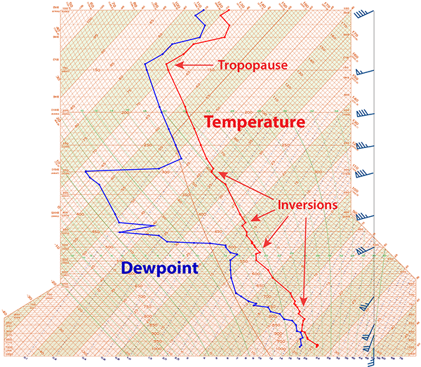
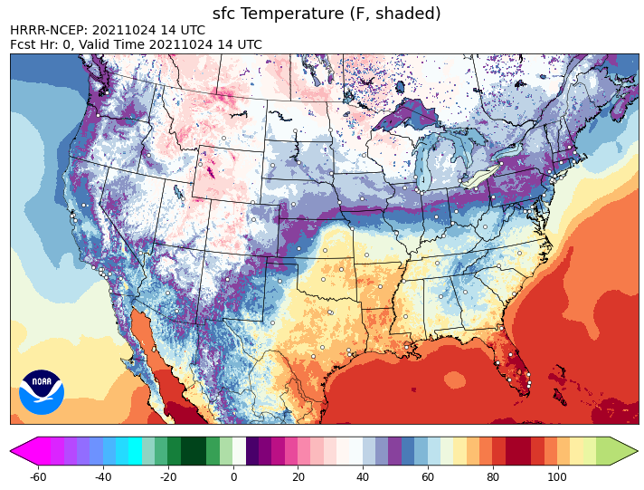
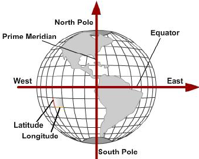

# Types of Weather Data

In general, there are two types of weather data: 
- Observed - "what is the weather currently (and in the recent past)?"
- Forecasted - "what do we think it will be like in the future?"

Inconveniently, both types of data are generated at different cadences, at different spatial and temporal resolutions, and in different formats. 

## Observed

We can observe the current weather using sensors on the ground, in the sky, or in space. Some mechanisms of observing weather data include satellites, radar, and individual weather observing sensors. 

Satellite and radar instruments observe electromagnetic radiation utilizing complex radiative transfer equations to determine what type of atmosphere a particular radiation signature has travelled through. Weather data sensors don't necessarily need to be complex, they can simply be observing the current temperature or humidity at a given location on the earth. All of it is valuable and is the "truth" that goes into the weather models for predicting future conditions. Sensors are rigorously tested prior to operational use and are continuously validated to ensure the data is accurate. 

### Satellite Data

Over the last few decades, hundreds of satellites have been launched and are currently in orbit over our earth. They have many sensors onboard their platform that observe radiation signatures to determine what they are seeing. Some satellites that are stationary over a given location on the earth's surface (geostationary) which are approximately 40km away in space, and some satellites continuously orbit around the earth at lower altitudes (polar-orbiting). 

Each satellite has a different set of sensors that observe radiation at different wavelengths. When various wavelengths are used in conjunction, it allows us to determine what is happening at the surface of the earth or throughout the atmosphere that the radiation is travelling through. 

Polar orbiters are a little more complicated to work with because their field of view changes constantly and they only pass over the same location on the earth a few times per day. In order to get a global picture, you need to stitch together quite a few passes of the satellite through time. A big benefit though is that their data is very high resolution since they are much closer to the Earth's surface. These satellites are great for needing to see fine details of the Earth's surface. 

**For more info on satellite data:**

This paper does a fantastic deep-dive into various types of satellite data and how satellite sensors work. [https://severeweather.wmo.int/TCFW/RAIV_Workshop2018/11_IntroSatellites_JackBeven.pdf](https://severeweather.wmo.int/TCFW/RAIV_Workshop2018/11_IntroSatellites_JackBeven.pdf) 

### Radar Data

The next type of observed data that is important to meteorology is radar data. Radar ground stations are located a couple of hundred miles apart across the United States to provide a nationwide site-picture. 

There are a few reasons that radar ground stations still exists and haven't been replaced by satellite observation of storms. 
1. Geostationary satellites have mostly passive sensors (meaning that they don't emit a pulse) since the Earth is so far away. These passive observations aren't able to tell you what type of particle exists in a given cloud. There are various types of precipitation and hail that can produce drastically different forecasts, and knowing the composition of a cloud is very important for that. 
2. Additionally, storms move across distances fairly quickly and the close polar-orbiting satellites that could use active sensors don't view the same spot for enough time to determine storm trajectory.

### Station data

The final type of major observed weather data comes from thousands of individual point-in-time observations taken every hour at various locations across the globe. 

There are a few standard observations that most weather models use as a source of truth: 
- METAR - Meteorological Aerodrome Report, ground station reports
    - Sensors located at most airports to observe temperature, pressure, cloud cover, wind speed, and wind direction every hour. 
- RAOB - Radiosonde Observations, balloons launched to obtain atmospheric vertical profiles
    - Weather balloons carry radiosondes aloft from 92 stations across the United States, and around 500 locations worldwide twice daily. 
    - They measure atmospheric pressure, temperature and relative humidity as well as calculate wind speed and direction at 1 second intervals, from balloon release until flight termination (usually balloon burst).
- AIREP and PIREP - Aircraft Report or Pilot Report, aircraft observations in-flight

**Example Raw METAR Data**
> KOMA 112052Z 34016KT 10SM FEW040 FEW200 29/17 A2997 RMK AO2 SLP139 60000 T02940172 50006

**Example RAOB Sounding Plot**

## Forecasted

The other main type of weather data is forecasted data (ie. model data). As a complete over-generalization, the Earth's weather changes based on fluid dynamics. The atmosphere is made up of moisture particles that travel through various gases and aerosols that exist in the air. Those water droplets are then impacted by all sorts of forces: gravity, temperature disparities on the earth's surface, the spin of the planet, and about a dozen other factors. 

 Many government agencies have their own weather models (sets of algorithms) used to predict the weather. As you can imagine, doing these calculations for the trajectories of water particles over the entire globe is complex and intense. Some models require supercomputers to complete a model run and will produce petabytes of data per day. Unfortunately for the data handlers (us), this insane amount of data is also quite perishable which means that those petabytes of data don't stay relevant. The data keeps changing. 

Each day, most agencies run their model every 6 hours. This cadence was probably chosen because it was the fastest that the computers could generate a full suite of data that predicts 10 days of weather. 

Weather models produce data in 5 dimensions: 
- longitude (x)
- latitude (y)
- altitude (z)
- time (t)
- paramter (p, ex. temperature, wind, pressure)

The x and y dimension are fairly straightforward; however, modelers do have to take into account the way to handle equations at the North and South pole. Typically, you'll see weather data projected onto a 2 dimensional grid of latitude and longitude like this.

**GET A BETTER IMAGE**

But (as we all know!), Earth isn't flat like that. So when you see this grid, the very top and bottom of the map is actually a single point on the face of the earth. Sometimes models are run in different projections when trying to predict weather close to the poles.

**GET A BETTER IMAGE**

[https://www.researchgate.net/publication/259932493_Exploring_GPS_Data_for_Operational_Analysis_of_Farm_Machinery](https://www.researchgate.net/publication/259932493_Exploring_GPS_Data_for_Operational_Analysis_of_Farm_Machinery)

*Forecasted meteogram image*

### Rapid updates

### Ensembles

## Data Format

Alright, we've learned that there are hundreds of different sensors that observe weather data every day and there are dozens of agencies that produce dozens of models every day. 
- What do you think the chances are that they all produce data in the same output format and that it is easy to extract just the information you need for your analysis or forecast? 

If you guessed near zero, you are absolutely correct! Now we're going to dissect some of the most common weather data formats and how someone could interact with that data in its raw form.

GRIB

NETCDF

XML

TXT